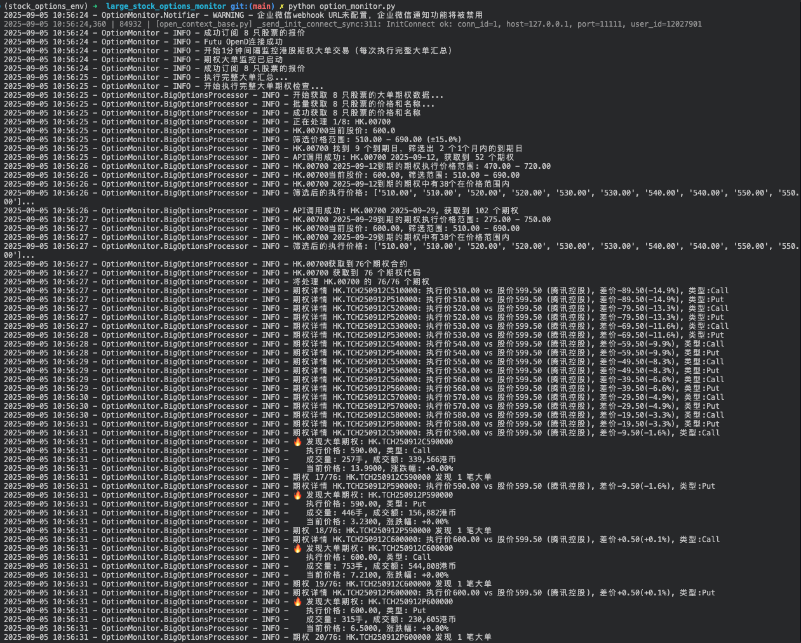
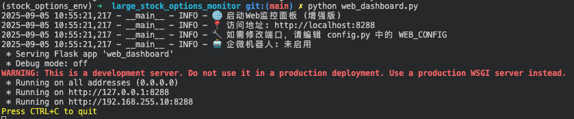
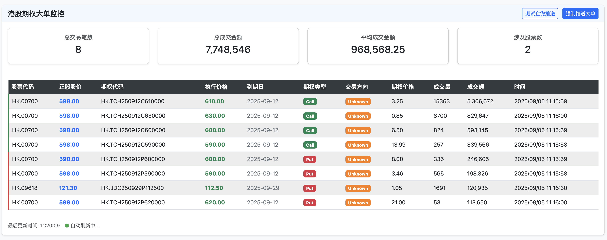
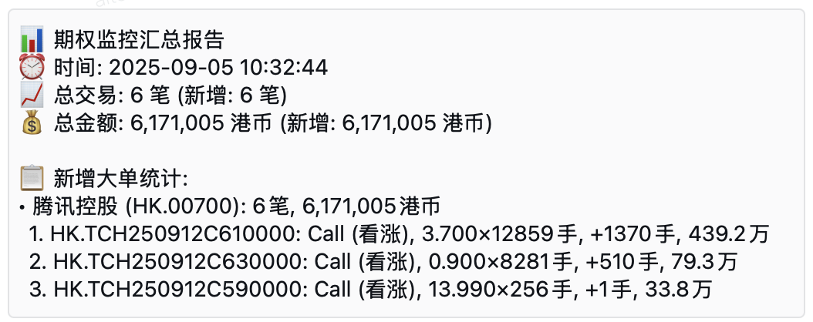

# 港股期权大单监控系统

基于Futu OpenD的港股期权大单监控系统，支持企微机器人推送、交易量变化检测和股票名称显示。

## 🚀 功能特点

- **实时监控**：监控指定港股的期权大单交易
- **智能分析**：自动识别期权类型(Call/Put)和交易方向(买入/卖出)
- **交易量变化检测**：只通知交易量发生变化的大单，避免重复通知
- **股票名称显示**：在所有通知和汇总中显示股票名称，更加直观
- **多渠道通知**：
  - 企微机器人推送
  - Mac系统通知
  - Web界面实时查看
- **数据汇总**：自动生成交易汇总报告
- **定时刷新**：每5分钟自动刷新一次数据
- **股价缓存机制**：优化API调用，提高性能

## 📋 安装依赖

```bash
# 用conda创建虚拟环境
conda create -n stock_options_env python=3.11
# 激活conda
conda activate stock_options_env
# 安装依赖
pip install -r requirements.txt
```

## ⚙️ 配置说明

所有配置都在`config.py`文件中：(从config.py.example改为config.py使用)

- `FUTU_CONFIG`: Futu OpenD连接配置
- `MONITOR_STOCKS`: 监控的港股列表
- `OPTION_FILTER`: 期权大单筛选条件
  - `min_volume`: 最小成交量（手）
  - `min_turnover`: 最小成交额（港币）
  - `min_premium`: 最小权利金
  - `price_range`: 价格范围
  - `show_all_big_options`: 是否显示所有符合条件的大单（即使交易量没有变化）
- `MONITOR_TIME`: 监控时间设置
  - `interval`: 监控间隔（秒）
  - `lookback_days`: 回看天数
- `NOTIFICATION`: 通知设置（包含企微机器人配置）
- `LOG_CONFIG`: 日志配置
- `DATA_CONFIG`: 数据存储配置
- `WEB_CONFIG`: Web面板配置
- `EARNINGS_CONFIG`: 财报监控配置

## 🔧 企微机器人配置

在`config.py`中配置企微机器人：

```python
'wework_config': {
    'webhook_url': 'https://qyapi.weixin.qq.com/cgi-bin/webhook/send?key=xxxxxxxx',  # 企微机器人webhook地址
    'mentioned_list': [],  # @的用户列表，如 ['@all'] 或 ['userid1', 'userid2']
    'mentioned_mobile_list': [],  # @的手机号列表
}
```

详细申请步骤请参考 `WEWORK_SETUP.md`。

## 📱 使用方法

1. 启动Futu OpenD
   ```bash
   # 确保Futu OpenD已正确安装并运行
   # 默认连接地址: 127.0.0.1:11111
   ```

2. 运行期权监控程序
   ```bash
   python option_monitor.py
   ```


3. 启动Web界面（可选）
   ```bash
   python web_dashboard.py
   ```

4. 使用单次运行模式（测试用）
   ```bash
   python option_monitor.py --once
   ```

## 📸 运行时截图

### 控制台输出




### Web界面


### 企微机器人通知



## 🌐 Web界面功能

- 实时显示大单期权数据
- 自动刷新（可配置刷新间隔）
- 显示期权类型(Call/Put)和交易方向(买入/卖出)
- 显示股票名称和代码
- 显示交易量变化情况
- 首次加载和数据更新时自动推送到企微机器人
- 提供企微机器人测试按钮

## 💾 数据存储

- 大单期权汇总: `data/current_big_option.json`
- 历史交易记录: `data/option_trades.csv`
- 日志文件: `logs/option_monitor.log`
- 推送记录缓存: 用于避免重复推送相同的大单

## 🔄 交易量变化检测

系统会记录每个期权的交易量，并在下次检测时比较变化：
- 🔥 标记表示交易量有变化的新大单
- ⚪ 标记表示符合大单条件但交易量没有变化的期权
- 可通过配置 `show_all_big_options` 选项控制是否显示所有符合条件的大单

## 📊 股价信息显示

- 系统会获取并显示股票名称，使通知更加直观
- 使用 `get_market_snapshot` API 获取股票名称和价格
- 实现了股价缓存机制，减少API调用次数

## ⚠️ 注意事项

- 确保Futu OpenD已正确配置并启动
- 交易时段内运行以获取实时数据
- 可根据需要调整筛选条件
- 企微机器人需要先申请并配置Webhook地址
- 系统默认每5分钟刷新一次数据，可在配置中调整


## 🤝 贡献 (Contributing)

欢迎 PR / Issue / Discussion  


## 💖 赞助 (Sponsor)

新人第一次做开源，希望各位大佬赏个鸡腿🍗，谢谢！

<details>
<summary>展开查看微信 / 支付宝打赏二维码</summary>

<p>
  
  
</p>

</details>


## ⭐ Star History

[](https://star-history.com/#altenli/large_stock_options_monitor&Date)